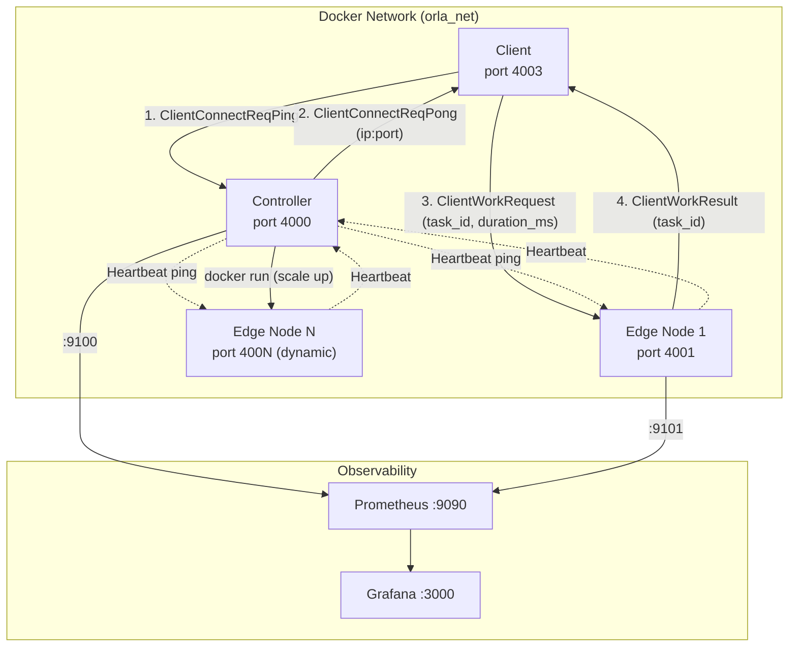
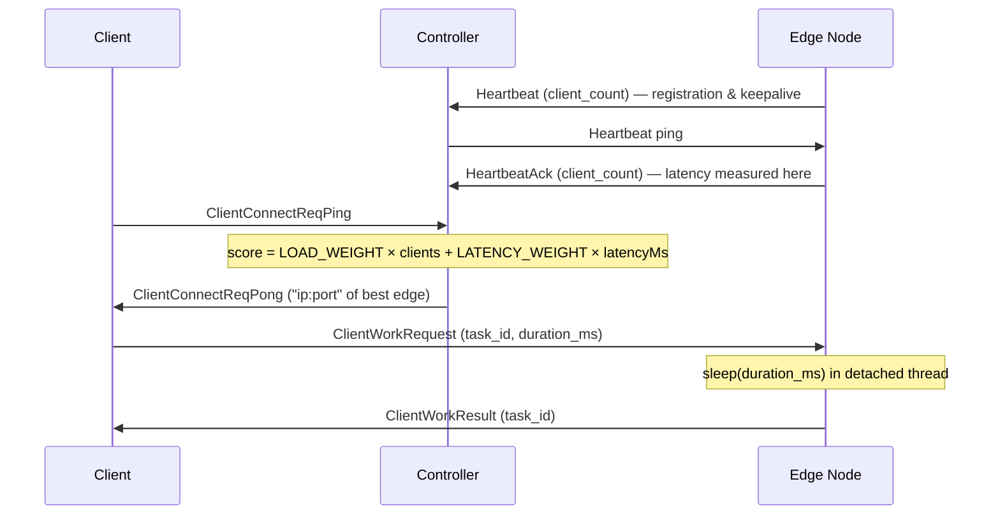

# Orla
A high-performance C++ distributed edge node simulator, communicating over unreliable networks and featuring latency-aware routing and adaptive load balancing. Built using [Juntos](https://github.com/nmstory/juntos), my networking library.

## Getting Started

To get started, fetch latest on the repo or use a stable package that's been generated.

Firstly, ensure Docker is installed and currently running. Then to run Orla, use:
```
docker compose up
```

Once running, Grafana and the observability dashboard can be accessed at:

```
localhost:3000
```

## How does Orla work?

The functionality of this simulation focuses on three distinct set of peers: clients, controllers and edges.

A client is spawned who first makes contact to the Controller, to reuqest an edge server. The controller will then decide the most optimum edge to use (see the [Load Balancing & Auto Scaling](#load-balancing-auto-scaling--configuration) section below for the scoring formula). 

After a client has been matched to an edge, it will send work, consisting of various timed delays.

This edge network simulator utilises [Juntos](https://github.com/nmstory/juntos) for peer to peer UDP communication, and deploys packet loss, delay and re-ordering mechanisms to stress test systems.

The performance of this edge network can be analysed using it's Grafana dashboard, see the [Metrics](#metrics) section for more details.

### Load Balancing, Auto Scaling & Configuration

Orla employs dynamic scaling to actively increase and decrease the number of edges in the network, based on client demand.

To be able to assign clients to the correct edge and to know exactly when an edge should be deployed or removed, Orla uses a scoring formula to understand monitor each edge (_the lower, the better_):

```
score = (LOAD_WEIGHT x clientCount) + (LATENCY_WEIGHT * latencyMs)
```
_whereby:_
* **LOAD_WEIGHT:** A weighting to define the importance of the number of clients to each edge.
* **clientCount:** Sent by the edge when it heartbeats, to describe how many clients it's currently serving
* **LATENCY_WEIGHT:** A weighting to define the importance of latency, when scoring an edge
* **latencyMs:** The round-trip time from the Controller to an Edge server, calculated from the heartbeat.
* Predetermined weights and thresholds are defined in ```include/config.h```, to determine the importance of scoring values and when exactly the auto scaler should scale up or down.

## Metrics

Prometheus scrapes metrics from the controller and any active edge nodes. Since edges are spawned dynamically, Prometheus uses Docker service discovery via a socket proxy to automatically detect new edge containers (identified by the ```orla.role=edge``` label) rather than relying on a static scrape config. The proxy also limits API exposure to read-only container queries.

_Prometheus Data Points:_
| Metric | Type | Description |
|---|---|---|
| `active_edges` | Gauge | Number of edge nodes currently alive |
| `scaling_events_total` | Counter | Scale-up/down events, labelled by `direction` |
| `tasks_completed_total` | Counter | Tasks completed per edge node |
| `task_duration_seconds` | Histogram | Task processing time distribution |
| `active_clients` | Gauge | Clients currently assigned to an edge |
| `bytes_sent_total` | Counter | Total bytes sent per node |
| `bytes_received_total` | Counter | Total bytes received per node |
| `bytes_dropped_total` | Counter | Packets dropped due to simulated network loss |

## Internals

Additional literature to better understand the architecture and flow of Orla.

### Project Structure

```
orla/
├── include/
│   ├── simulator.h        # entry point — selects node role from ROLE env var
│   ├── controller.h       # load balancing, auto-scaling, edge lifecycle
│   ├── edge_node.h        # processes client work requests
│   ├── client.h           # connects to controller, dispatches work
│   ├── network_adapter.h  # Juntos UDP adapter with simulated packet loss/delay
│   ├── message.h          # message types, serialisation, CRC32
│   └── config.h           # scoring weights and scaling thresholds
├── src/
│   └── main.cpp
├── monitoring/
│   ├── prometheus.yml     # scrape config with Docker service discovery
│   └── grafana/           # provisioned dashboard and datasource
├── external/              # Juntos and prometheus-cpp (git submodules)
├── Dockerfile
└── docker-compose.yml
```

### Flow Diagram


### Sequence Diagram

